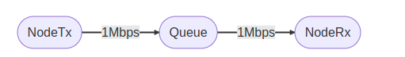
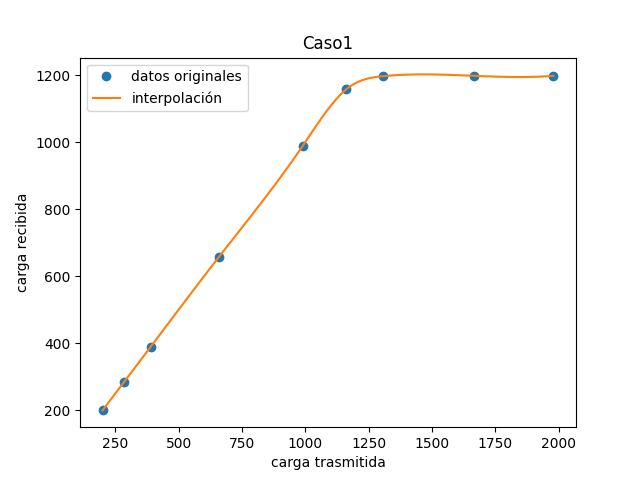
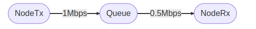
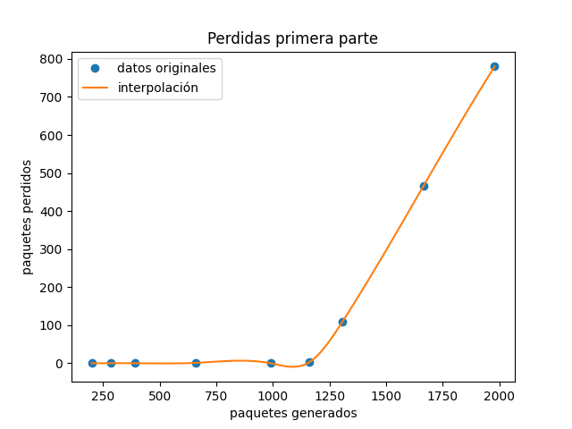
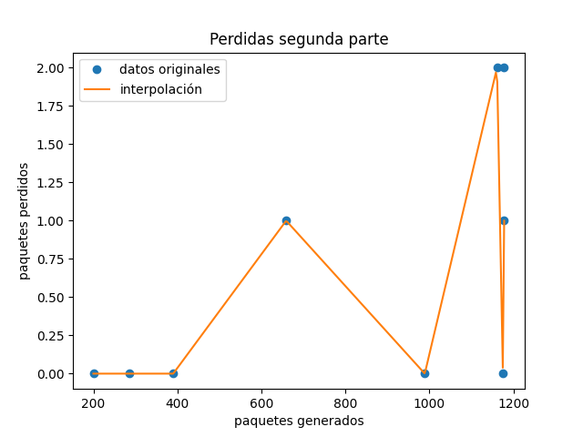
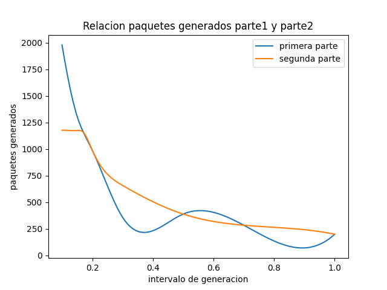
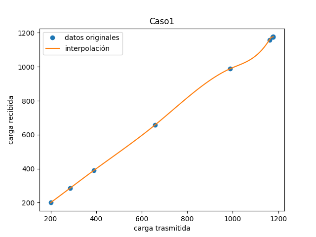
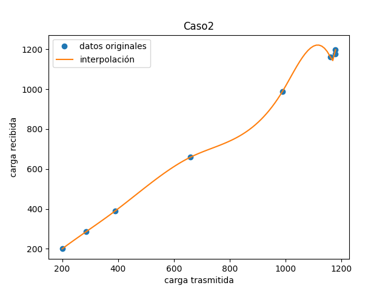

q# Tercer laboratorio : Capa de Transporte 
###### Redes y sistemas distribuidos: famaf 2023
## Integrantes 
- Ignacio Cuevas
- Juan Guglieri 
- Tomas Marmay

## Introduccion
- Este laboratorio es nuestra primera interaccion con **omnetpp** en el cual vamos a reproducir distintas simulaciones de distintas redes para estudiar su comportamiento y hacer analisis sobre ellas.
El laboratorio consta de 2 partes:
    - `Tarea de analisis` : Dada una red tenemos que observar distintos casos y sacar algunas concluciones de su comportamiento. 
    - `Tarea de diseño` : Implementar un algoritmo que resuelva los problemas de **control de flujo** y **control de consgestion**.
### Terea de analisis
Luego de hacer las debidas modificaciones, espicificadas en las [consignas](lab3-enunciado.pdf), se debia estudiar sobre el comportamiento de los dos posibles casos de la estructura de la red:
- Caso1 : genera un cuello de botella en el *reseptor* representado por **NodeRx**. 
- Caso2 : genera un cuello de botella en la *subred*, que conecta el nodo emisor **NodeTx** con el nodo receptor **NodeRx**, representado por **Queue**.
Los datos a continuacion son los resultantes de correr la simulacion durante *200 seg* con un tamaño de paquete de *12500 bytes*, diferentes tiempos de generacion de paquetes y para **Queue** y **NodeRx** un tamaño de buffer de *200 paquetes*. Para informacion mas detallada ver [consignas](lab3-enunciado.pdf). 
Con el fin de tener una grafica mas precisa, se uso spline para interpolar los datos obtenidos. 

#### Caso1
- En este grafico podemos ver la tasa de trasnferencia del caso1, es facil notar que en este caso hay un problema de `control de flujo` debido a la saturacion del receptor:

donde **NodeRx** es: 

Estas son algunas de las mediciones que obtuvimos de **NodeTx** en la simulacion:

|Intervalo de generacion                |Carga transmitida                          |Carga recibida                         |
|----------------|-------------------------------|-----------------------------|
|1|200            |200            |
|0,7          |285            |285            |
|0,2          |989|989|
|0,17          |1162|1159|
|0,1          |1979|1199|

#### Caso2
- En este grafico podemos ver la tasa de transferencia del caso2, a diferencia del caso anterior podemos notar que hay un problema de `control de congestion` debido a la saturacion que hay en la subred:

Estas son algunas de las mediciones que obtuvimos de **Queue** en la simulacion:

|Intervalo de generacion                |Carga transmitida                          |Carga recibida                         |
|----------------|-------------------------------|-----------------------------|
|1|200            |200            |
|0,7          |285            |285            |
|0,2          |989|989|
|0,17          |1162|1160|
|0,1          |1979|1199|

##### Observaciones
- En ambos graficos podemos notar que a medida que decrese el intervalo de generacion de paquetes pasan dos cosas:
    - Se generan mas cantidad de maquetes
    - Se pierde mas cantidad de paquetes

- Debido a que tanto **NodeRx** como **Queue** tienen el mismo tamaño de buffer y que son el "mismo" problema pero en distintos sectores, las graficas son bastante parecidas
- En ambos casos la perdida de paquetes empezo a ocurrir cuando el generation interval deciende de los 0,2

### Terea de diseño

En esta etapa del proyecto, teniamos que hacer un algoritmo que resulva los problemas observados en la primera parte. Para ello se hicieron algunas modificaciones en la estructura de la red para poder mandar un **Feedback** de cuando algun buffer de alguna de las colas estaba por saturarse. Las consecuencias de esta implementacion es que no aprovechamos los buffers al **100%** sino que al **80%**, debido a que cuando un buffer llega al 80% de su capacidad, se manda un mensaje al emisor para que baje la tasa de transmicion y poder estabilizar la trasferencia, asegurandose que los bufferes no superen el 80%.
Para observar las mejoras que causo este algoritmo veamos algunos graficos de comparacion con la parte anterior.

- El primer grafico represneta las perdidas de paquetes que teniamos en la primer parte, comparada con la perdida de paquetes que tenemos luego de implementar el algortimo.

**Cosas a notar :**
    - Disminucion de paquetes perdidos.    
    - Oscilacion de paquetes perdidos, lo que significa que el algoritmo va autoregulando la cantidad de paquetes a mandar. 

    

- Una consecuencia de este algoritmo, que la podemos ver en este grafico, es que no se generan la misma cantidad de paquetes como en la parte1

- Y por ultimo los mismos graficos que para la **parte de diseño**

 