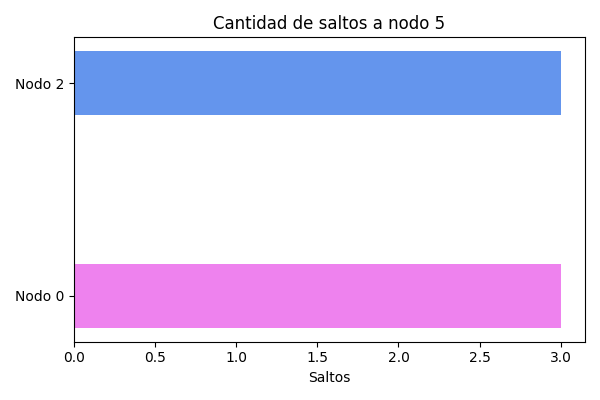
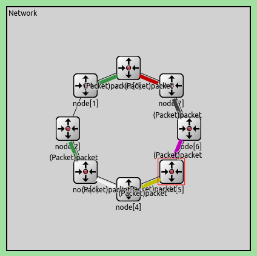

# Cuarto laboratorio: red
###### famaf 2023

## Integrantes
- Ignacio Cuevas
- Juan Cruz Guglieri
- Tomas Marmay

## Introduccion
En este laboratorio vamos a estudiar el comportamiento de la capa de red y la tecnología relacionada a ella.
El laboratorio consta de dos partes:
- Tarea de análisis: consiste en hacer algunos análisis del comportamiento de una red con topología anillo.
- Tarea de diseño: consiste en diseñar un algoritmo capaz de enrutamiento.

### Tarea de análisis
Deberemos estudiar cómo se comporta la siguiente red, teniendo en cuenta cosas como:
- Demora de entrega de paquetes
- Utilización de los recursos de la red (buffers y enlaces)
- Cantidad de saltos utilizados por cada paquete


#### Caso 1
En este caso, solo el **nodo 0** y el **nodo 2** pueden generar paquetes, que van dirigidos al **nodo 5**.
Este es el comportamiento que tuvo la red:

- Demora de entrega de paquetes


- Uso de buferes


- Uso de enlaces


- Cantidad de saltos por paquetes


#### Caso 2
En este caso hay que buscar un valor de `interArrivalTime` tal que mantenga un *equilibrio* en la red. Definamos que *no* hay equilibrio en la red cuando un nodo se pasa la mayoria del tiempo mandando sus paquetes o se pasa la mayoria del tiempo mandando paquetes ajenos. 
Veamos los nodos que sabemos que van a tener mas sobrecarga que otros, por ejemplo el nodo 6. 
En los sigientes graficos podemos observar que pasa cuando variamos el valor de `interArrivalTime`.
- `interArrivalTime` = 1
  
- `interArrivalTime` = 0.1
  

Como se puede observar en los graficos anteriores, denotan dos extremos. Uno donde se atiende una cantidad similar de paquetes propios que ajenos, es decir atiende a los ajenos como si fuera un nodo mas pero en realidad son 6 nodos mas. Y otro extremo donde se la da prioridad a los ajenos y se descuida el envio de paquetes propios. 
Luego de hacer algunas mediciones llegamos a la conclucion de que un numero donde mantiene el equilibrio para **200seg** de tiempo de ejecucion es de `0.35`. Debido a que es proporcional la cantidad de paquetes agenos atendidos con la cantidad de nodos generadores.
Ademas añadimos como se comporta el nodo 1 para chequear que en el medio todo este andando bien.
- `interArrivalTime` = 0.35


### Tarea de diseño
En este punto debemos diseñar un modelo de enrutamiento tal que se note una mejoría en los tiempos de entrega del nodo productor al nodo destino, para ello primero decidimos mandar un mensaje de "mapping" o mapeo, el cual manda cada nodo, sin importar si es el productor o receptor, y cuenta cada nodo hasta llegar a este mismo, es decir lo recibe si y solo sí el que recibió este mensaje es el mismo que lo mando, este modelo guardaba en el paquete "mapping" todos los vecinos y cantidad de saltos que tenía que hacer para cada uno de estos, este paquete era enviado al ejecutarse el `initialize()` de cada nodo (8 en el caso del grafo anillo), luego con la información recolectada por la capa de red a través del paquete de mapeo, cada mensaje proveniente de la capa de aplicación era enviado por el mejor camino o camino mas corto. Para los grafos cíclicos (sin importar la cantidad de nodos) funcionaba a la perfección, pero para el grafo proporcionado para el punto estrella se nos complicó, por eso diseñamos un grafo de 5 nodos sin ser cíclico y un nodo podia tener más de 2 interfaces (conexiones bidireccionales entre nodos), y tampoco funcionaba con el modelo que habiamos implementado ya que cuando se mandaba el paquete de mapeo algunos paquetes se quedaban en una especie de loop infinito y por consecuencia se acababan los 200 segs de la corrida, por eso decidimos cambiar el modelo.  

##### Mejora del diseño
  
Basandonos en lo que hicimos hasta ahora nos decidimos a implementar un modelo de inundación, el cual vimos en las clases teóricas, en resumen inundación se basa en: para enviar un paquete de un origen u a un destino v los caminos usados son aquellos que respetan las siguientes reglas, u manda el mensaje por todas las líneas de salida y cada paquete que llega a un enrutador distinto de v se reenvía por cada una de las líneas excepto aquella por la que llegó. Usando mas o menos esa idea y como veníamos haciendo, decidimos que cada nodo deba enviar un paquete de mapeo por cada interfaz que tenga, cuando un mappingPkt (paquete de mapeo) llega a un nodo:  

1. verificar si este paquete fue enviado por este nodo, si es así eliminarlo.
2. tomar sus datos, duplicarlo tantas veces como interfaces tenga cada nodo (en cada grafo el numero de interfaces es constante, ej: el grafo cíclico 8 tiene 2 interfaces).
3. si ese paquete no cumple 1, y este paquete fué enviado por un nodo, el cual otro paquete con el mismo origen ya pasó por este nodo es eliminado, para que no se tornara infinito este proceso.  

Para mejor interpretación lo podemos ver en pseudocodigo:  

```c++
if (/*este paquete fue enviado por este nodo*/) {
  // obtener datos ...
  delete pkt;
} else {
  if (/*si el paquete de ese nodo ya fue procesado*/) {
    // obtener datos ...
  } else {
    // obtener datos ...
    // agregar el nodo a la lista de paquetes recibidos por nodos
    Packet *newPkt = pkt->dup();
    send(newPkt, "toLnk$o", out); 
  }
  delete pkt;
}
```  

donde out es la linea de salida por donde el paquete saldrá.  
Entonces, cuando ya todos los paquetes que fueron enviados por cada nodo en el initialize, ya obtuvimos toda la información necesaria para crear la rtable, una rtable es un diccionario que contiene como clave (key) el nodo a que tenemos disponible la interacción, y como valor (value) la mejor salida que ese nodo debe optar para enviar el paquete, antes de explicar como armamos ese diccionario, brevemente explicaremos que otras estructuras o tipos de datos son usadas para la recopilación de datos de los mappingPkt's.  
-  `struct NeighborData`, el cual tiene tres variables `int neighbor`, `int cost` y `int outGate`, neighbor es el nodo que ha enviado el paquete, cost es la cantidad de saltos que tuvo que pasar ese paquete para llegar al nodo actual, y outGate que es por donde entró ese paquete, para que si por ejemplo elegimos esta opcion como la mejor, el paquete de la App sea enviada por esta. Además tiene un booleano que es un operador ya que nos vimos obligados a crearlo para evitar un error con el tipo `set`.  
- `list<int> neighbors`, acá se guardan todos los vecinos, para que luego esta sea iterada para la creación del rtable.  
- `list<int> prevBoardcastedPackets`, este lo armamos cuando vienen nuevos paquetes de nodos no antes visto por el nodo actual, este se usa por si llega un paquete de un nodo que ya antes fue analizado este se elimine, ya que el costo de este seguramente sea mayor al que vino previamente.  
- `set<NeighborData> mappingData`, aca se almacena toda la información (de forma desordenada) que traen los mappingPkt's.  
- `packet Packet {int source; int destination; int hopCount; int out}`, este tipo es lo que transporta cada paquete desde que fue creado hasta su destrucción, este está definido en [packet.msg](lab4-kickstarter/packet.msg), source y destination son los que imponen la trayectoria del mismo (su origen y hacia donde tiene que llegar), hopCount guarda la cantidad de saltos y out por donde tiene que salir (si son dos interfaces como el cíclico puede ser 0 o 1).  

Entonces cuando ya es terminada la etapa de transmición de mappingPkt's entra una función a la cual llamamos createRTable, y esta es llamada solo una vez antes de enviar el primer mensaje proveniente de la capa de aplicación. Esta función itera por todos los nodos obtenidos en `neighbors`, y dentro de este ciclo itera además por todos los elementos almacenados en mappingData, verifica si el campo "vecino" del elemento obtenido al iterar del set es igual al vecino que esta actualmente el for "padre", luego obtenemos el menor costo y la salida (outGate) del elemento con menor costo, y a este lo guardamos como valor en el diccionario, teniendo como clave al vecino. Además la rtable es creada solo si el nodo quiere enviar un mensaje de la App, sino no se crea (como en el caso del cíclico de 8 nodos que como no se usa el nodo 1 nunca se crea su rtable), aqui un ejemplo obtenido cuando se corre en el network ciclico de 8 nodos:  

```c++
rtable en nodo: 0
Clave: 1, Valor: 1
Clave: 2, Valor: 1
Clave: 3, Valor: 1
Clave: 4, Valor: 0
Clave: 5, Valor: 0
Clave: 6, Valor: 0
Clave: 7, Valor: 0
```  

Igualmente, al correr nuestro proyecto al finalizar el initialize se imprimen por pantalla las rtable de cada nodo que esta en uso.  
Ya obtenido la rtable de cada nodo, cuando llega un mensaje de la app, u otro de la app pero de otro nodo, el programa llama a `sendAppPkt` el cual obtiene el destino de este paquete y se fija en el diccionario cual es la salida que debería tomar y asi ejecutar `send`.  
Nos surgió un problema que cuando queriamos enviar un mappingPkt del nodo 2 al 4 (por ejemplo en el grafo ciclico), este paquete se quedaba en el 3, luego de investigar la raiz de este problema, nos dimos cuenta que es porque a estos paquetes le asignamos el tipo 2 (`mappingPkt->setKind(2);`), entonces decidimos hacer un cambio minimo en [App.cc](lab4-kickstarter/App.cc) para que esto no ocurra, e hicimos esto:  

```c++
if (pkt->getKind() == 2) {
  pkt->setKind(1);
}
```  

El cual verifica si quiere enviar un paquete de la App y tenga por alguna razon el tipo 2, que lo cambie al tipo 1, ya así pudimos solucionar el problema.  
Para poder correrlo en la network del punto estrella nos salía un error que decía que no todas las interfaces estaban en uso, es decir, en el network de la estrella todos los nodos tienen 4 interfaces, tomando el nodo 0 vemos que solo tiene conectado el lnk 1, osea el 0, 2 y 3 no estaban en uso. Esto se nos quejaba el programa de simulación antes de poder correrlo ya que al mandar un paquete por el lnk 0 del nodo 0, por ejemplo, el programa no sabe que hacer ante esa situación, entonces luego de un largo tiempo tratando de solucionar esto, modificamos el archivo [Lnk.cc](lab4-kickstarter/Lnk.cc), agregando esto:  
 
```c++
if (gate("toOut$o")->getNextGate()->isConnectedOutside()) {
  send(pkt, "toOut$o");
  serviceTime = pkt->getDuration();
  scheduleAt(simTime() + serviceTime, endServiceEvent);
} else {
  delete pkt;
}
```  
Osea, si está conectado al exterior enviar el paquete, sino borrarlo. Antes de saltar al network del punto estrella, nos fabricamos un nuevo network el cuál comparte características con el network del punto estrella, pero con solo 6 nodos en lugar de 57 nodos para analizar mejor si ocurrian fallos, a este lo llamamos, *NetworkSemiStar*:  
  
Este network no cíclico tiene 6 nodos, cada uno con 4 interfaces las cuales obviamente no estan todos conectados, por eso con la solución anterior en *Lnk.cc*, pudimos solucionar que un nodo mande solo por el canal que puede ser utilizado.  
  
En esta imagen se puede ver el nodo 0 en "acción", enviando el paquete de mapeo por la unica salida disponible.  

Gracias al network parecido al NetworkStar con muchos nodos menos y con el cambio en en Lnk pudimos resolver el punto estrella, ya que anteriormente veniamos pensando al mismo tiempo de como resolver el network cíclico, como resolver el network del punto estrella, haciendo como dice el dicho: *"matando a dos pajaros de un tiro"*.  

### Analisis con nuevo algoritmo de enrutamiento
Ahora vamos a hacer un analisis comparativo entre el algoritmo original contra el nuevo. Para ello se realizaran las mismas pruebas para poder comparar de igual a igual los graficos obtenidos.


#### Caso 1 : De nodo 0 y 2 a nodo 5
Antes de comenzar con el analisis, notemos la diferencia `visual` entre el algoritmo viejo con el nuevo.


Este ahora toma el camino mas corto desde el nodo origen (0,2) al nodo destino (5).



Para este caso, vamos a ver tres versiones:

1. `interArrivalTime` = 1 con `packetByteSize` = 125000

2. `interArrivalTime` = 0.1 con `packetByteSize` = 12500

3. `interArrivalTime` = 0.35 con `packetByteSize` = 12500

Veamos primero la demora de paquetes:

1. 


2. 


3. 


Es notable, para cualquiera de las tres versiones, la mejora en relacion al algoritmo original. Antes se podia ver un crecimiento lineal de la relacion `(Tiempo de ejecucion, Delay)`, ahora esta relacion es casi constante o con un crecimiento muy lento.

Otro modo de comparar los algoritmos es viendo el uso interno de los buferes:

1. 


2. 


3. 


A diferencia del metodo anterior, ahora vemos un equilibrio y mayor distribucion de la utilizacion de los buferes internos. Antes se veia un crecimiento lineal en el uso del `bufer 0`, mientras que ahora se mantienen cerca del piso.

Hay que destacar que la tercera version, tiene un perfecto balance entre demora de paquetes y uso de buferes internos.

#### Caso 2 : Desde todos los nodos a nodo 5
Para hacer el analisis del caso 2 vamos a ver la relacion entre el envio de paquetes propios y ajenos enfocandonos en nodos clave.

Antes de comenzar el analisis veamos el recorrido que toman los paquetes con el nuevo algoritmo:



Primero veamos el caso en que `interArrivalTime` = 1:

Tanto el nodo 1 como el nodo 2 van a mostrar un comportamiento similar, ya que, como el algoritmo nuevo busca el camino mas corto hacia el destino, solamente enviaran paquetes propios y paquetes de mapeo.


Ahora bien, nodos con mucha carga como pueden ser el nodo 4 y el nodo 6 tienen el siguiente comportamiento:


Estos no mantienen un equilibrio entre cantidad de paquetes enviados propios y paquetes ajenos, porque como se dijo en analisis del algoritmo original, los paquetes ajenos provienen de mas de un nodo.

Ahora tomemos el `interArrivalTime` = 0.35, que es el punto de equilibrio de la red que habiamos encontrado con el primer algoritmo:

Para el caso de los nodos 1 y 2, va a mostrar exactamente el mismo comportamiento debido a que el camino que toman los paquetes es igual que antes.


En cambio, los nodos 4 y 6, que antes habiamos visto que no mantenian un equilibrio en la relacion de paquetes propios y paquetes ajenos enviados, ahora se puede observar una mayor estabilidad.


Si comparamos con el primer algoritmo, estos reaccionan de la misma forma. Pero la diferencia entre estos yace en la cantidad de paquetes de nodos diferentes que recibe cada nodo. Ya que, debido a nuestra implementacion, cada nodo recibira paquetes de una menor cantidad de nodos diferentes.

### Posibles mejorias
El algoritmo en general funciona muy bien, pero los siguientes aspectos se podrian mejorar:

**Aprovechamiento en la red**: 

Como el algoritmo busca el camino mas corto hacia el destino, utiliza un solo camino (o sentido si pensamos en la topologia de anillo).

Pensemos el caso en que la cantidad de nodos de la red es par, por ejemplo 6, los nodos estan enumerados del 0 al 5 en sentido horario y queremos mandar paquetes del nodo 0 al nodo 3.

El algoritmo mandaria paquetes por exactamente uno de los sentidos (digamos horario), pero con el fin de enviar mayor cantidad de paquetes sin llenar los buferes de los nodos 1 y 2, podriamos paralelizar el envio de paquetes enviando paquetes en ambos sentidos.

Esto es mas notable en el caso estrella, donde cada nodo podria tomar varios caminos hacia el nodo destino pero, en cambio, este sigue solo el camino mas corto al destino.


### Punto Estrella
Para el caso estrella vamos a ver dos casos:
1. De nodos 0,5 a nodo 20
2. De nodos 0-8 a nodo 50

Cada caso se simula con un `interArrivalTime` = 1.

### Caso 1


Como podemos observar, cada nodo va a enviar paquetes tomando el camino mas corto hacia el destino. Pero como se dijo en las `mejoras`, el nodo 0 podria tomar el camino del nodo 6,9,11,14,22,21,20. 


Ese defecto, nos cuesta una demora de paquetes con un creciemiento lineal en relacion con el tiempo de ejecucion.

### Caso 2


Este segundo caso demuestra lo mismo que se dijo para el caso 1. Hay varios nodos que podrian tomar un camino diferente para aprovechar mejor el uso de la red.


En este caso, como todos los nodos comparten gran parte de, o toda, la ruta desde el origen al destino, la demora de paquetes sigue siendo lineal pero con un coeficiente de crecimiento mayor que el caso anterior donde solo dos nodos compartian rutas.

### Conclusion

A pesar del defecto mencionado anteriormente, para cualquier caso que sea podemos asegurar que los paquetes, eventualmente, van a llegar.